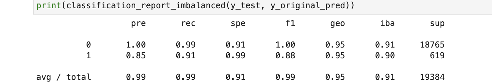
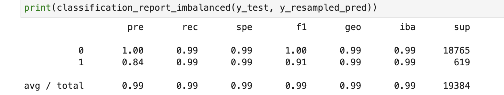

# Risky_Loan_Resampling

## Overview of the Analysis

The purpose of this Analysis is to bring balance to credit risk classification using various techniques to train and evaluate models
with imbalanced classes. For this analysis we will use lending data that provides loan information from over 77,000 loans. This gives
us plenty of information to get solid feedback for our analysis and how we view future loans and predict credit worthiness.
Using 'y' as our 'loan status' variable and 'X' as our variable to represent the remaining columns (loan_size, interest_rate, borrower_income,	debt_to_income,	num_of_accounts, derogatory_marks,	total_debt,	loan_status) we where able to check the balance of the variables to predict using the
'value_counts' function before spliting the data into training and testing datasets using 'train_test_split'.

The stages of our machine learning process where as follows.

* Model: A machine learning model mathematically represents a collection of untrained real world information. Creating a model of our untrained data was the first step.

* Fit: The fit or "training stage" is used to fit the model to the data. The model is adjusted to match patterns in the data learning
to adjust or "train" itself to make predictions matching the data we give it.

* Predict: Once the model has been fit or "trained" to the data we can use the trained model to predict new data. When the model is given
new data that's similar enough to the data that previoulsy recieved it can predict the outcome for that data.

Methods used to aqcuire resampled data where 'RandomOverSampler' and 'LogisticRegression'. The purpose of using 'RandomOverSampler'
is to randomly select instances of the minority class and add the to the training set until we have balanced the majority and minority classes.
'LogisticRegression' is a classification algorithm. It is designed to predict discrete ourtcomes therefor we can use it to make predictions by
analyzing available data. When presented with a new sample of data the model mathimatically determines the probability of the sample belonging
to a class. The model then assigns the sample to that class.


## Results

Using bulleted lists, describe the balanced accuracy scores and the precision and recall scores of all machine learning models.

* Machine Learning Model 1:
  * Model 1 Accuracy 95% , Precision 85% , and Recall score 91%.



* Machine Learning Model 2:
  * Model 2 Accuracy 99% , Precision 84% , and Recall score 99%.


## Summary

Being that our focus here is on high risk loans (class 1) we see that by using 'RandomOverSampler' to create balance between 'Healthy' and 
'high risk' loans we can more accuratly predict future outcomes by using 'LogisticRegression'. As you can see our original model was solid at 
95% accuracy and a recall of 91%. When compared to a balanced resampled model at 99% accuracy and 99% recall we can clearly see that in this instance 
the resampled model is the way to go and is why I recommend going with the resampled model for its superior accuracy.


## Installations

```bash
conda install -c conda-forge imbalanced-learn
```
```bash
conda install -c conda-forge pydotplus
```
